# Go-barber-frontend

#### Link para o repositório de back-end da aplicação: https://github.com/PatrickOtero/Go-Barber-back-end

### SPA com React.js

#### - TECNOLOGIAS UTILIZADAS:

  - React.js
  - React-router-dom
  - Context-api
  - React-use
  - Axios
  - React-day-picker
  
#### - PASSOS NECESSÁRIOS PARA O FUNCIONAMENTO DO APP LOCALMENTE NO SEU SISTEMA:

    1° - Baixe a engine (motor) que interpretará as funcionalidades das dependências em javascript, o Node, através deste link: https://nodejs.org/en/download/
    2° - Selecione o instalador de acordo com o seu sistema operacional e arquitetura (32-bit ou 64-bit)
    3° - Ao abrir o instalador do Node, pressione o botão "next" até o final.
    4° - Clone este repositório para o seu computador, vá até a pasta clonada e execute seu terminal na mesma.
    5° - Execute o comando no diretório raíz (onde está localizada a pasta "src"): "npm i".
    6° - Espere o interpretador instalar todos os arquivos necessários para rodar o projeto.
    7° - Execute o comando no mesmo local: "npm start"
    8° - Aguarde a abertura do projeto em seu navegador padrão.
      
      
### Importante: Você precisará baixar também o backend desta aplicação para que ela funcione localmente.

#### Se quiser ver online, tenha em mente que a listagem de agendamentos não está funcionando e eu ainda não descobri por quê, já que ela funciona localmente (você mesmo pode comprovar). Link: https://patrickotero-gobarber.netlify.app/

     OBS: O sistema deste app está hospedado em um serviço gratuíto que limita o tempo em que ele pode ficar online, portanto, o aplicativo pode não funcionar quando testar, se for esse o seu caso, terá que esperar para testar até o início do próximo mês ou poderá me procurar através de qualquer contato disponibilizado para que eu tente resolver o problema

## Tela de login
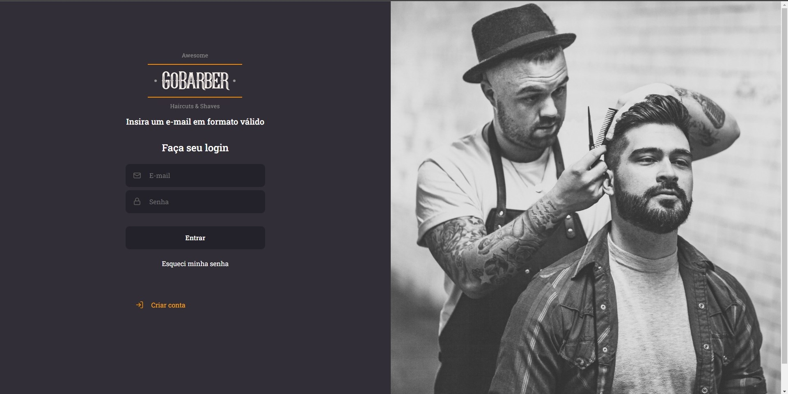

## Tela de cadastro
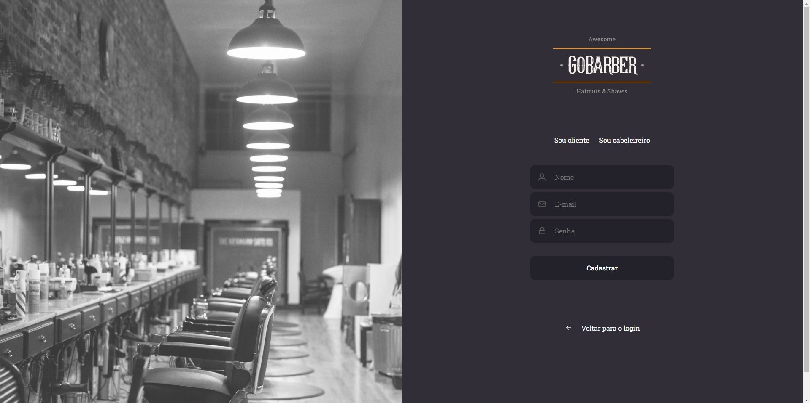

## Tela home do cabeleireiro
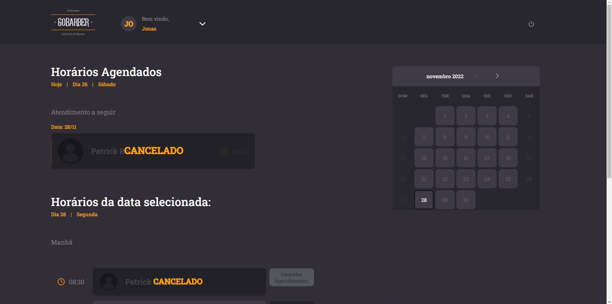

## Tela de edição do perfil do cabeleireiro e do cliente
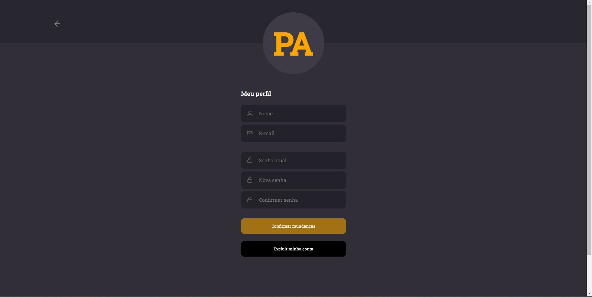

## Tela home do cliente
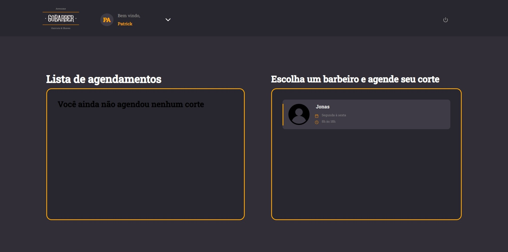

## Tela de agendamento
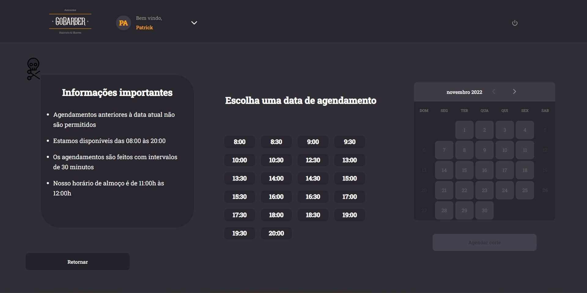

## Tela de sucesso de agendamento
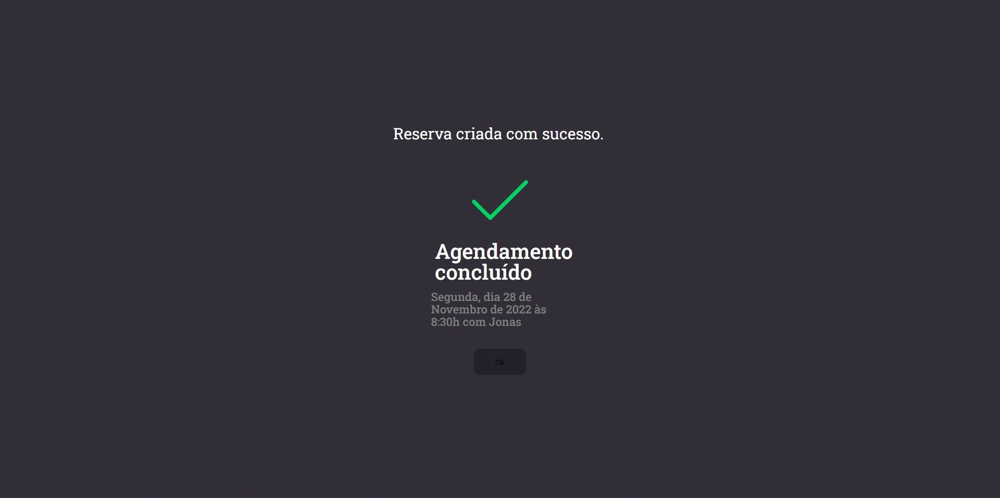

## Modal de exclusão de perfil
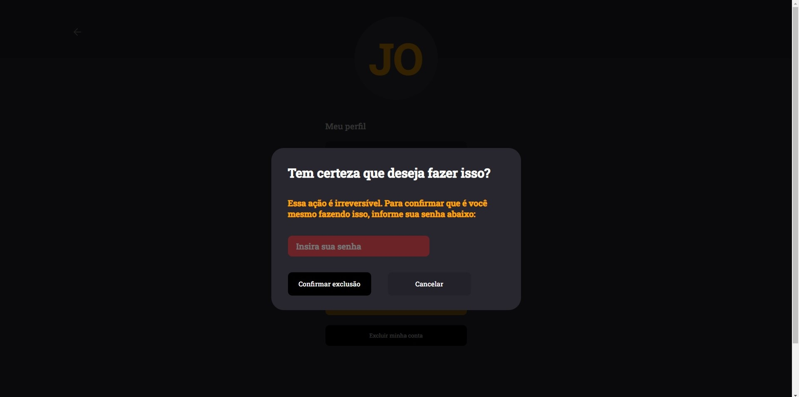

## Modal de exclusão de agendamento
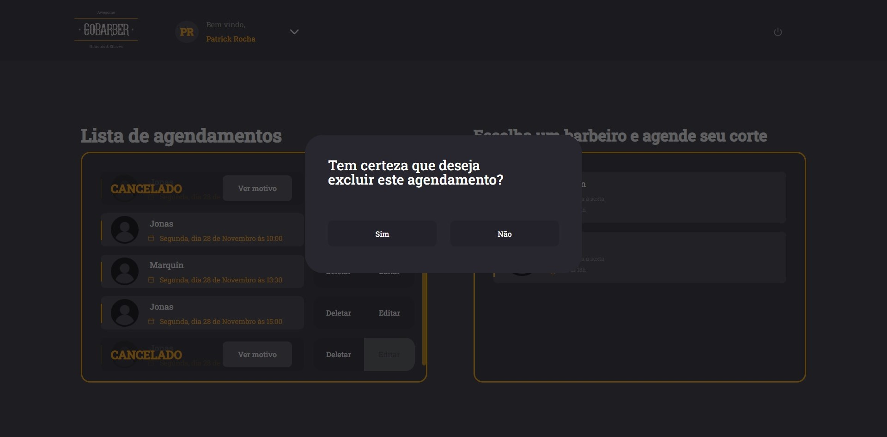

## Modal de visualização de motivo de cancelamento de agendamento
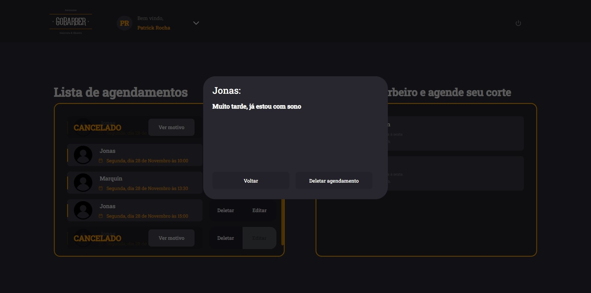

## Tela de recuperação de senha
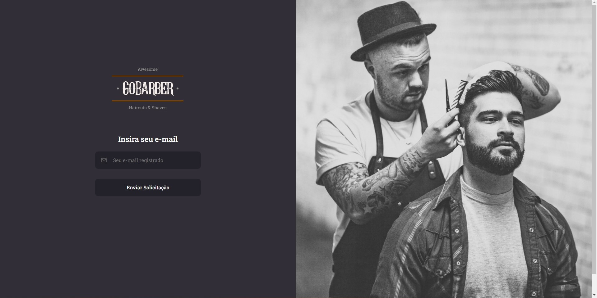

## Email com o link para redefinição de senha
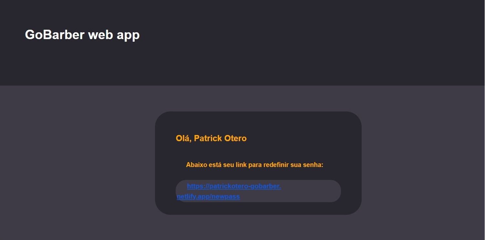

## Tela de redefinição de senha
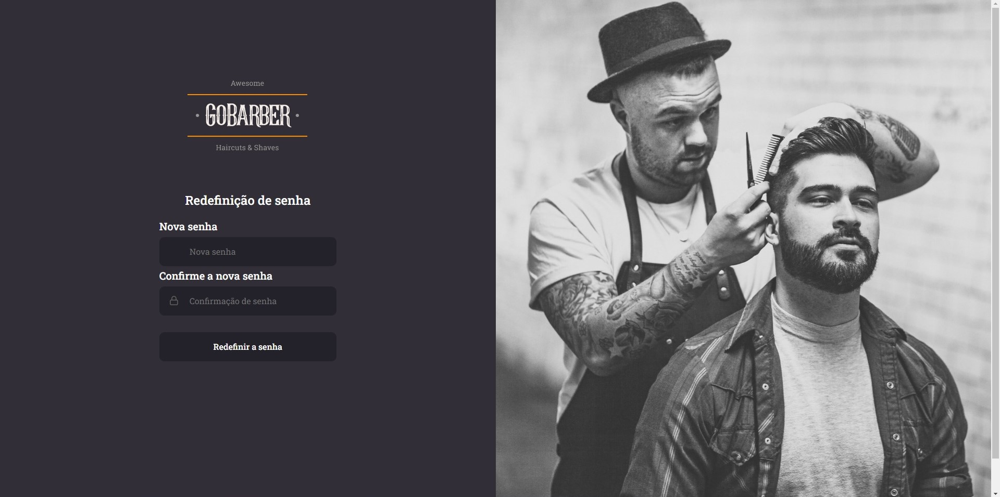

### Muito obrigado pela boa vontade.